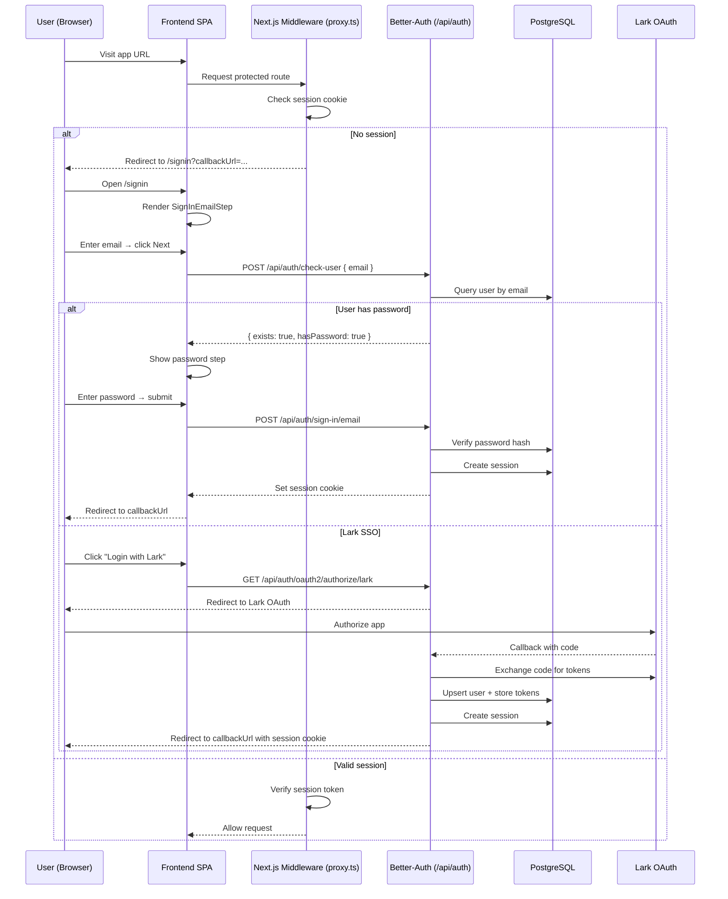

# Authentication Flow

```mermaid
sequenceDiagram
    participant U as User (Browser)
    participant FE as Frontend SPA
    participant MW as Next.js Middleware (proxy.ts)
    participant BA as Better-Auth (/api/auth)
    participant DB as PostgreSQL
    participant Lark as Lark OAuth

    U->>FE: Visit app URL
    FE->>MW: Request protected route
    MW->>MW: Check session cookie
    alt No session
        MW-->>U: Redirect to /signin?callbackUrl=...
        U->>FE: Open /signin
        FE->>FE: Render SignInEmailStep
        U->>FE: Enter email → click Next
        FE->>BA: POST /api/auth/check-user { email }
        BA->>DB: Query user by email
        alt User has password
            BA-->>FE: { exists: true, hasPassword: true }
            FE->>FE: Show password step
            U->>FE: Enter password → submit
            FE->>BA: POST /api/auth/sign-in/email
            BA->>DB: Verify password hash
            BA->>DB: Create session
            BA-->>FE: Set session cookie
            FE-->>U: Redirect to callbackUrl
        else Lark SSO
            U->>FE: Click "Login with Lark"
            FE->>BA: GET /api/auth/oauth2/authorize/lark
            BA-->>U: Redirect to Lark OAuth
            U->>Lark: Authorize app
            Lark-->>BA: Callback with code
            BA->>Lark: Exchange code for tokens
            BA->>DB: Upsert user + store tokens
            BA->>DB: Create session
            BA-->>U: Redirect to callbackUrl with session cookie
        end
    else Valid session
        MW->>MW: Verify session token
        MW-->>FE: Allow request
    end
```
