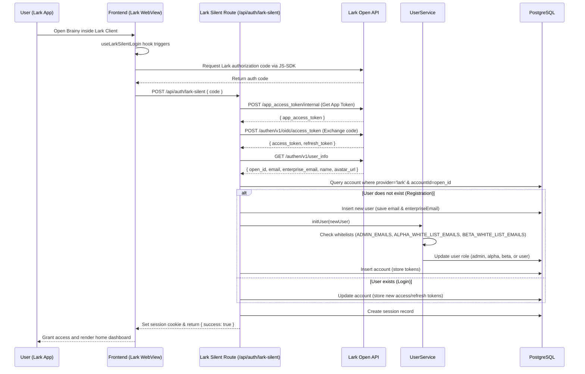
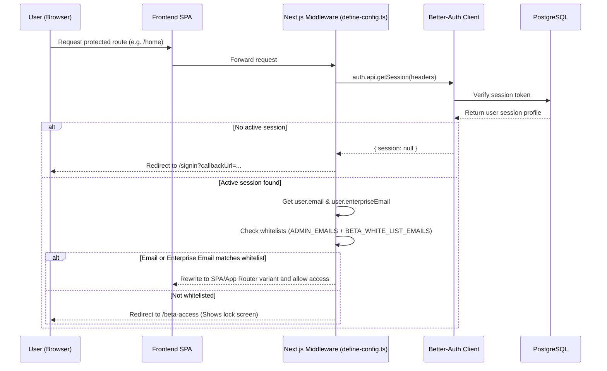
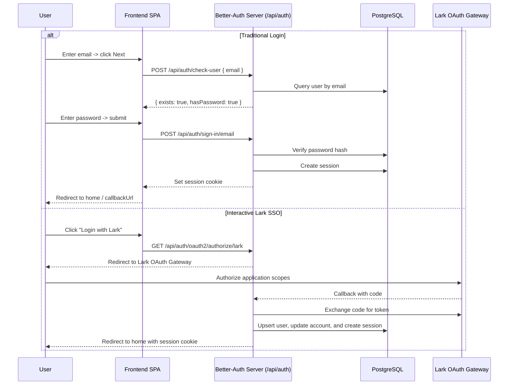

# Authentication & Access Control Flow

This document describes the sequence of authentication and role/access verification for traditional login, Lark SSO, Lark Silent Login, and Beta Whitelist checks.

---

## 1. Silent Login Flow (Inside Lark WebView)

This flow triggers automatically when a user opens the Brainy workspace within the Lark mobile or desktop client:

---

## 2. Beta Access Check Flow (Middleware Verification)

If `APP_BETA_MODE=true` is set in the environment, the Next.js middleware verifies that every session is whitelisted before serving requests:

---

## 3. Traditional OAuth & Password flows

