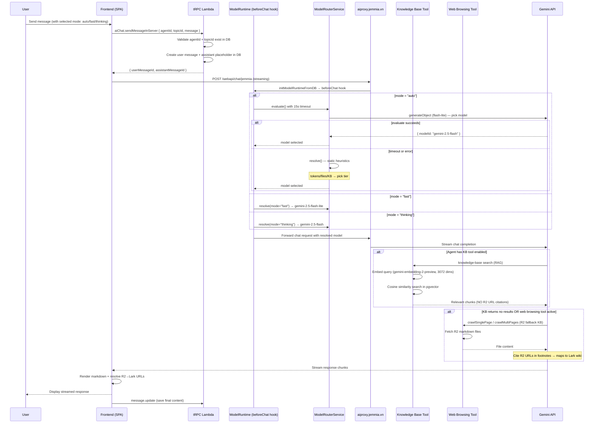

# Core Chat Flow — User Message to Response



## Mode Decision Logic

```
payload.model = "auto" / "fast" / "thinking" / "expert"
                    ↓
            beforeChat hook
                    ↓
    ┌───────────────────────────────┐
    │ auto                          │
    │  1. evaluate() [15s timeout]  │
    │     → LLM picks model         │
    │  2. fallback: resolve()       │
    │     → static heuristics       │
    │     · 3+ files / >256k → pro  │
    │     · KB/RAG/Lark → flash     │
    │     · default → flash-lite    │
    ├───────────────────────────────┤
    │ fast    → gemini-2.5-flash-lite│
    │ thinking→ gemini-2.5-flash    │
    │ expert  → gemini-2.5-pro      │
    └───────────────────────────────┘
```

## KB vs Web Browsing (R2 Fallback)

```
User query
    ↓
KB Tool (knowledge-base) ──→ Indexed local markdown (pgvector 3072d)
    │                         No R2 URL citations in response
    │ if no results / rate limit
    ↓
Web Browsing Tool ──────────→ Crawls R2 URLs directly
                              Cites R2 URLs → getLarkUrlForR2() → Lark wiki
```
