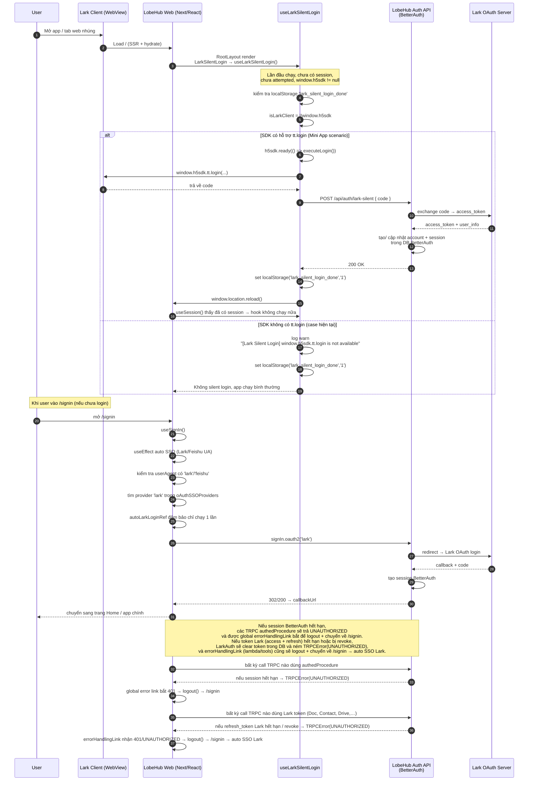

### 1. Auth & Silent Login Flow (hiện trạng)

```mermaid
sequenceDiagram
    autonumber

    participant User
    participant LarkApp as Lark Client (WebView)
    participant WebApp as LobeHub Web (Next/React)
    participant SilentHook as useLarkSilentLogin
    participant AuthAPI as LobeHub Auth API<br/>(BetterAuth)
    participant LarkOAuth as Lark OAuth Server

    User->>LarkApp: Mở app / tab web nhúng
    LarkApp->>WebApp: Load / (SSR + hydrate)
    WebApp->>SilentHook: RootLayout render<br/>LarkSilentLogin → useLarkSilentLogin()

    Note over SilentHook: Lần đầu chạy, chưa có session,<br/>chưa attempted, window.h5sdk != null

    SilentHook->>SilentHook: kiểm tra localStorage 'lark_silent_login_done'
    SilentHook->>SilentHook: isLarkClient = !!window.h5sdk

    alt SDK có hỗ trợ tt.login (Mini App scenario)
        SilentHook->>SilentHook: h5sdk.ready(() => executeLogin())
        SilentHook->>LarkApp: window.h5sdk.tt.login(...)
        LarkApp-->>SilentHook: trả về code
        SilentHook->>AuthAPI: POST /api/auth/lark-silent { code }
        AuthAPI->>LarkOAuth: exchange code → access_token
        LarkOAuth-->>AuthAPI: access_token + user_info
        AuthAPI->>AuthAPI: tạo/ cập nhật account + session<br/>trong DB BetterAuth
        AuthAPI-->>SilentHook: 200 OK
        SilentHook->>SilentHook: set localStorage('lark_silent_login_done','1')
        SilentHook->>WebApp: window.location.reload()
        WebApp->>SilentHook: useSession() thấy đã có session → hook không chạy nữa
    else SDK không có tt.login (case hiện tại)
        SilentHook->>SilentHook: log warn<br/>"[Lark Silent Login] window.h5sdk.tt.login is not available"
        SilentHook->>SilentHook: set localStorage('lark_silent_login_done','1')
        SilentHook-->>WebApp: Không silent login, app chạy bình thường
    end

    Note over User,LarkApp: Khi user vào /signin (nếu chưa login)

    User->>WebApp: mở /signin
    WebApp->>WebApp: useSignIn()
    WebApp->>WebApp: useEffect auto SSO (Lark/Feishu UA)

    WebApp->>WebApp: kiểm tra userAgent có 'lark'/'feishu'
    WebApp->>WebApp: tìm provider 'lark' trong oAuthSSOProviders
    WebApp->>WebApp: autoLarkLoginRef đảm bảo chỉ chạy 1 lần
    WebApp->>AuthAPI: signIn.oauth2('lark')
    AuthAPI->>LarkOAuth: redirect → Lark OAuth login
    LarkOAuth-->>AuthAPI: callback + code
    AuthAPI->>AuthAPI: tạo session BetterAuth
    AuthAPI-->>WebApp: 302/200 → callbackUrl
    WebApp-->>User: chuyển sang trang Home / app chính

    Note over WebApp,AuthAPI: Nếu session BetterAuth hết hạn,<br/>các TRPC authedProcedure sẽ trả UNAUTHORIZED<br/>và được global errorHandlingLink bắt để logout + chuyển về /signin.<br/>Nếu token Lark (access + refresh) hết hạn hoặc bị revoke,<br/>LarkAuth sẽ clear token trong DB và ném TRPCError(UNAUTHORIZED),<br/>và errorHandlingLink (lambda/tools) cũng sẽ logout + chuyển về /signin → auto SSO Lark.

    WebApp->>AuthAPI: bất kỳ call TRPC nào dùng authedProcedure
    AuthAPI-->>WebApp: nếu session hết hạn → TRPCError(UNAUTHORIZED)
    WebApp->>WebApp: global error link bắt 401 → logout() → /signin

    WebApp->>AuthAPI: bất kỳ call TRPC nào dùng Lark token (Doc, Contact, Drive,…)
    AuthAPI-->>WebApp: nếu refresh_token Lark hết hạn / revoke → TRPCError(UNAUTHORIZED)
    WebApp->>WebApp: errorHandlingLink nhận 401/UNAUTHORIZED → logout() → /signin → auto SSO Lark
```
